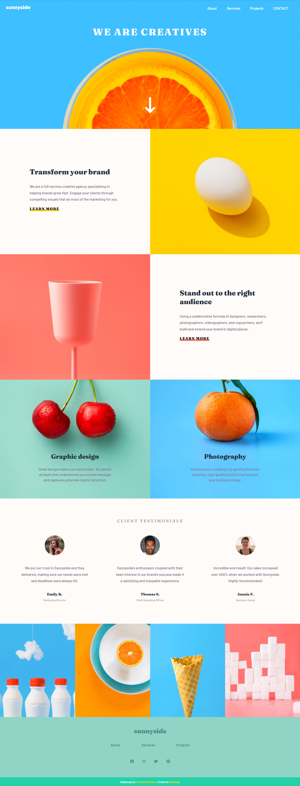

# 🐾 Frontend Mentor - Sunnyside agency landing page solution

This is a solution to the [Sunnyside agency landing page challenge on Frontend Mentor](https://www.frontendmentor.io/challenges/sunnyside-agency-landing-page-7yVs3B6ef). Frontend Mentor challenges help you improve your coding skills by building realistic projects.


## 📸 Screenshot




## 🔗 Links

- Live Site URL: [Visit online](http://blahking.github.io/pages/01-frontend-mentor-1)


## ✍️ What I learned 

```css
.grid-container {
  grid-template-columns: 1fr 1fr;
}

.transform.grid-container {
  grid-template-areas: "left right";
}

.transform .content {
  grid-area: left;
}
```


