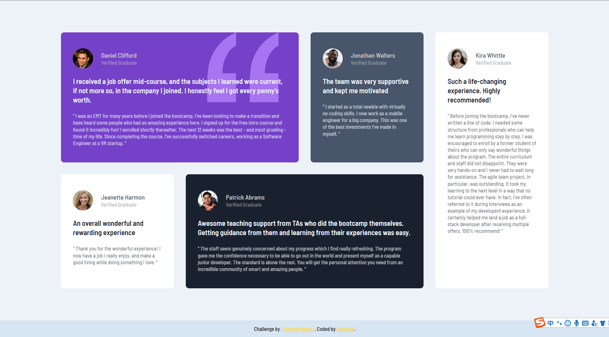

# 🐾 Frontend Mentor - Testimonials grid section solution

This is a solution to the [Testimonials grid section challenge on Frontend Mentor](https://www.frontendmentor.io/challenges/testimonials-grid-section-Nnw6J7Un7). Frontend Mentor challenges help you improve your coding skills by building realistic projects. 


## 📸 Screenshot




## 🔗 Links

- Live Site URL: [Visit online](http://blahking.github.io/pages/03-frontend-mentor-3)


## ✍️ What I learned 

```css
@media (min-width: 1200px) {
  .container {
    grid-template-columns: repeat(4, 1fr);
    row-gap: 30px;
    column-gap: 30px;
    grid-template-areas:
      "A A B C"
      "D E E C";
  }

  .testimonial:nth-child(1) {
    grid-area: A;
  }

  .testimonial:nth-child(2) {
    grid-area: B;
  }

  .testimonial:nth-child(3) {
    grid-area: D;
  }

  .testimonial:nth-child(4) {
    grid-area: E;
  }

  .testimonial:nth-child(5) {
    grid-area: C;
  }
}
```


