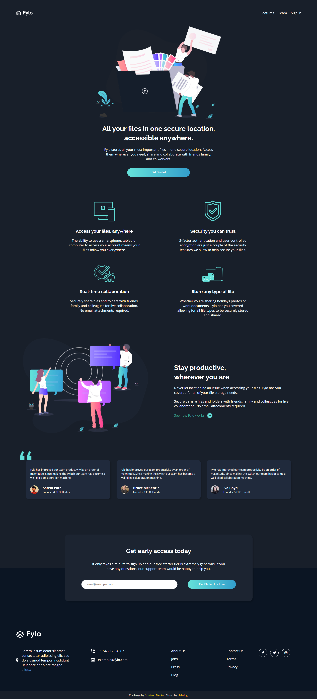

# 🐾 Frontend Mentor - Fylo dark theme landing page solution

This is a solution to the [Fylo dark theme landing page challenge on Frontend Mentor](https://www.frontendmentor.io/challenges/fylo-dark-theme-landing-page-5ca5f2d21e82137ec91a50fd). Frontend Mentor challenges help you improve your coding skills by building realistic projects. 


## 📸 Screenshot




## 🔗 Links

- Live Site URL: [Visit online](http://blahking.github.io/pages/06-frontend-mentor-6)


## ✍️ What I learned 

### linear-gradient
```css
button {
    background: linear-gradient(to right, hsl(176, 68%, 64%), hsl(198, 60%, 50%));
}

button:hover {
  background: linear-gradient(to left, hsl(176, 68%, 64%), hsl(198, 60%, 50%));
}
```

### max-width is very useful in responsive website
```css
.item-icon {
  width: 25%;
  max-width: 200px;
}

.content-container {
  max-width: 550px;
}

.testimonial {
  max-width: 500px;
}

.start {
  width: 60%;
  max-width: 900px;
}
```


