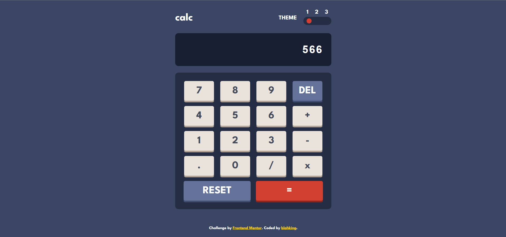
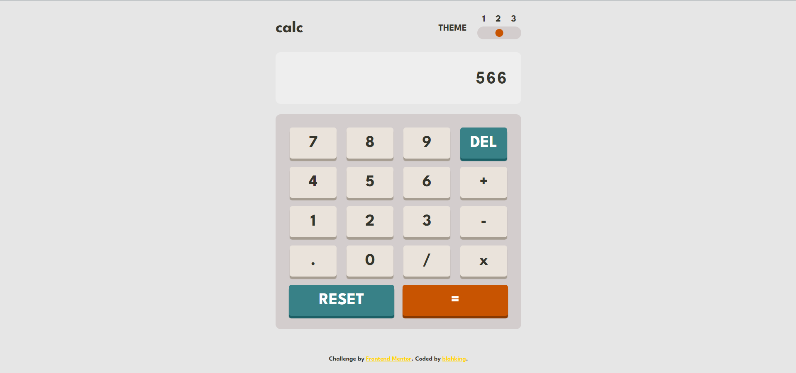
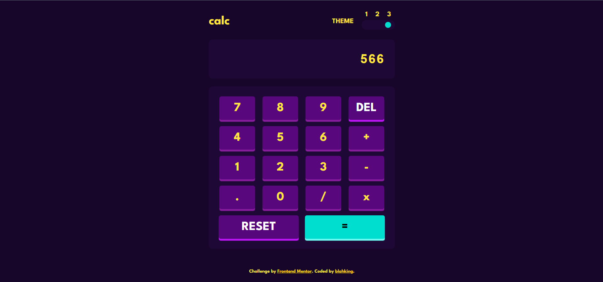

# 🐾 Frontend Mentor - Calculator app solution

This is a solution to the [Calculator app challenge on Frontend Mentor](https://www.frontendmentor.io/challenges/calculator-app-9lteq5N29). Frontend Mentor challenges help you improve your coding skills by building realistic projects. 

## 👀 Features
- theme switch
- simple calculation

## 📸 Screenshot
### theme1

### theme2

### theme3

## 🔗 Links

- Live Site URL: [Visit online](http://blahking.github.io/pages/07-frontend-mentor-7)

