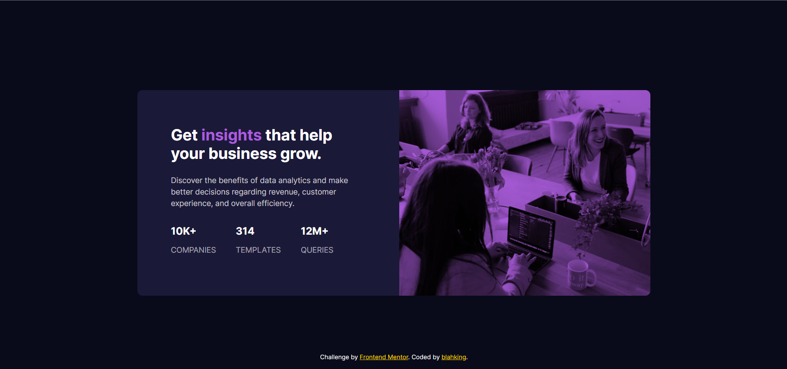

# 🐾 Frontend Mentor - Stats preview card component solution

This is a solution to the [Stats preview card component challenge on Frontend Mentor](https://www.frontendmentor.io/challenges/stats-preview-card-component-8JqbgoU62). Frontend Mentor challenges help you improve your coding skills by building realistic projects.


## 📸 Screenshot




## 🔗 Links

- Live Site URL: [Visit online](http://blahking.github.io/pages/09-frontend-mentor-9)


## ✍️ What I learned 

```css
.card-img {
  height: 240px;
  background-image: url(./images/image-header-desktop.jpg);
  background-size: cover;
  background-color: hsl(277, 64%, 61%);
  background-blend-mode: multiply;
}
```


