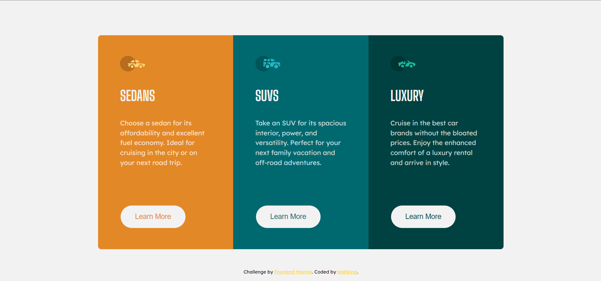

# 🐾 Frontend Mentor - 3-column preview card component solution

This is a solution to the [3-column preview card component challenge on Frontend Mentor](https://www.frontendmentor.io/challenges/3column-preview-card-component-pH92eAR2-). Frontend Mentor challenges help you improve your coding skills by building realistic projects.  

## 📸 Screenshot

## 🔗 Links

- Live Site URL: [Visit online](http://blahking.github.io/pages/11-frontend-mentor-11)

