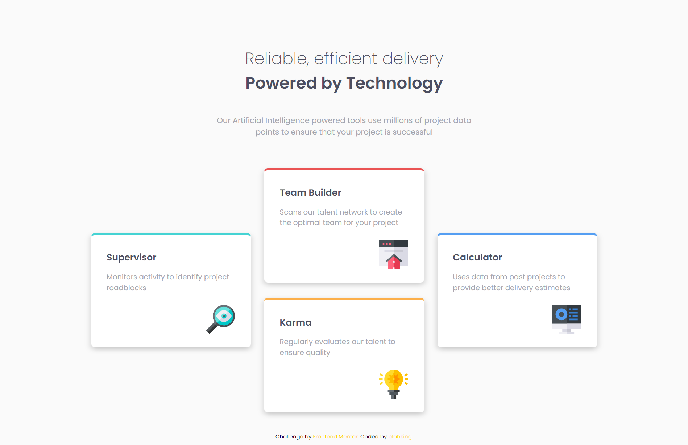

# 🐾 Frontend Mentor - Four card feature section solution

This is a solution to the [Four card feature section challenge on Frontend Mentor](https://www.frontendmentor.io/challenges/four-card-feature-section-weK1eFYK). Frontend Mentor challenges help you improve your coding skills by building realistic projects. 


## 📸 Screenshot




## 🔗 Links

- Live Site URL: [Visit online](http://blahking.github.io/pages/12-frontend-mentor-12)


## ✍️ What I learned 

```css
@media (min-width: 1200px) {
  main {
    display: grid;
    grid-template-columns: repeat(3, 1fr);
    grid-template-rows: 2;
    column-gap: 30px;
    align-items: center;
    grid-auto-flow: column;
  }

  .supervisor,
  .calculator {
    grid-row-start: 1;
    grid-row-end: 3;
  }
}
```