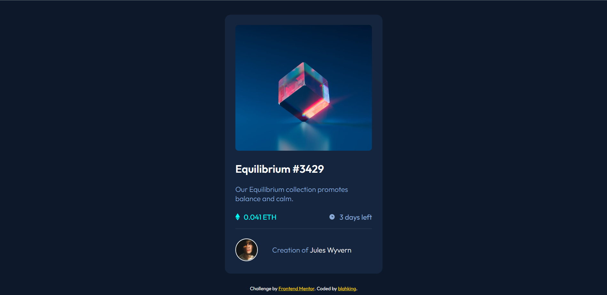

# 🐾 Frontend Mentor - NFT preview card component solution

This is a solution to the [NFT preview card component challenge on Frontend Mentor](https://www.frontendmentor.io/challenges/nft-preview-card-component-SbdUL_w0U). Frontend Mentor challenges help you improve your coding skills by building realistic projects. 


## 📸 Screenshot




## 🔗 Links

- Live Site URL: [Visit online](http://blahking.github.io/pages/13-frontend-mentor-13)


## ✍️ What I learned 

```css
.img-container .mask {
  position: absolute;
  left: 0;
  right: 0;
  top: 0;
  bottom: 0;
  display: none;
  background-color: rgba(0, 255, 247, 0.5);
}
```