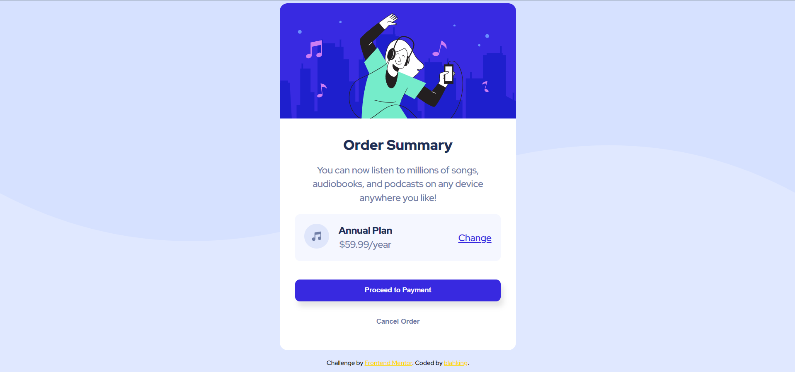

# 🐾 Frontend Mentor - Order summary card solution

This is a solution to the [Order summary card challenge on Frontend Mentor](https://www.frontendmentor.io/challenges/order-summary-component-QlPmajDUj). Frontend Mentor challenges help you improve your coding skills by building realistic projects. 


## 📸 Screenshot




## 🔗 Links

- Live Site URL: [Visit online](http://blahking.github.io/pages/14-frontend-mentor-14)


## ✍️ What I learned 

```html
<picture>
  <source srcset="./images/pattern-background-desktop.svg" media="(min-width: 1200px)" />
  
</picture>
```

```css
picture {
  position: absolute;
  top: 0;
  left: 0;
  right: 0;
  z-index: -1;
}
```